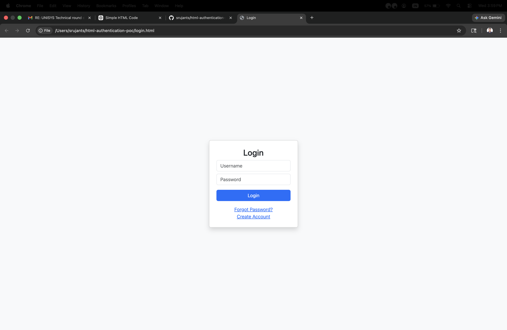
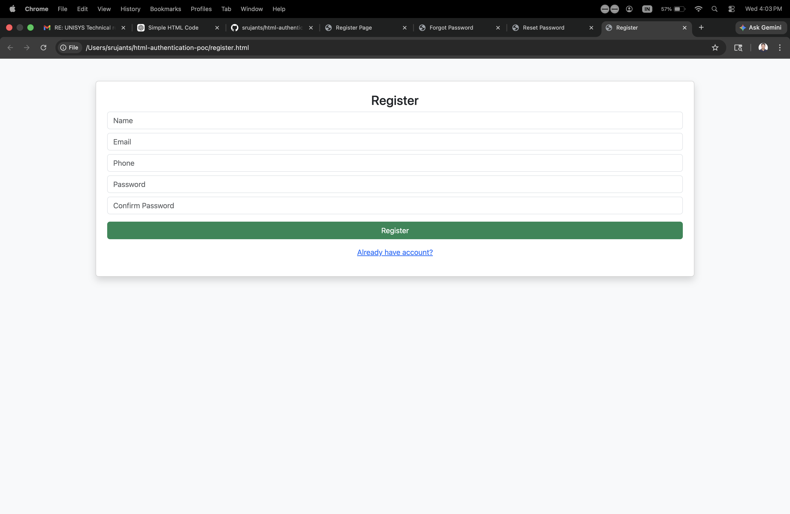
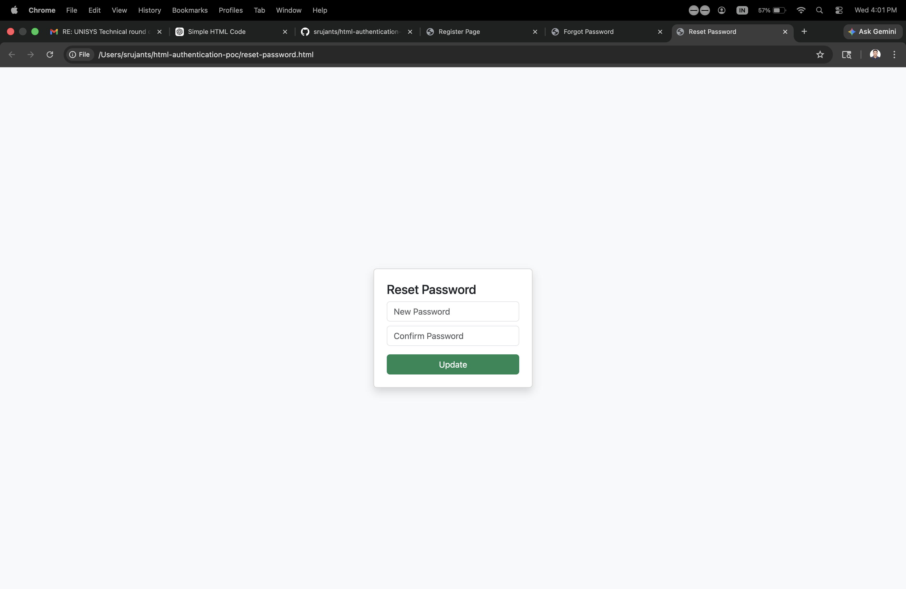
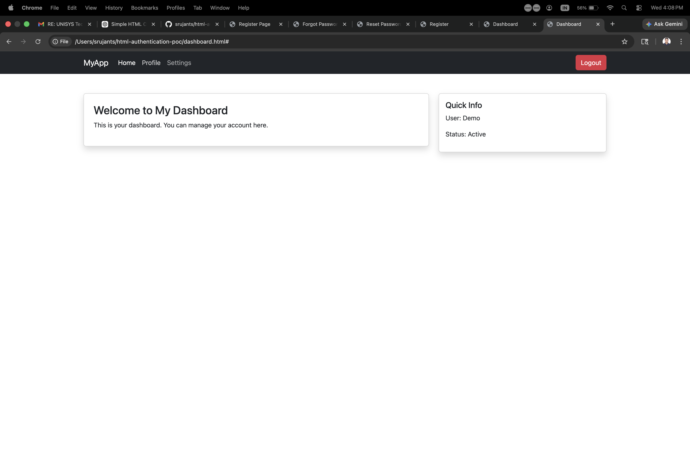

cat > README.md <<EOF
# Authentication System (Styled)

This project is a simple authentication system built using HTML, Bootstrap 5, and custom CSS.

## Features
- Login Page
- Registration Page
- Forgot Password Page
- Reset Password Page
- Dashboard Page
- Responsive Design using Bootstrap

## Technologies Used
- HTML
- Bootstrap 5
- CSS

## Screenshots

### Login Page

### Registration Page

### Forgot Password Page

### Reset Password Page

### Dashboard Page

EOF
